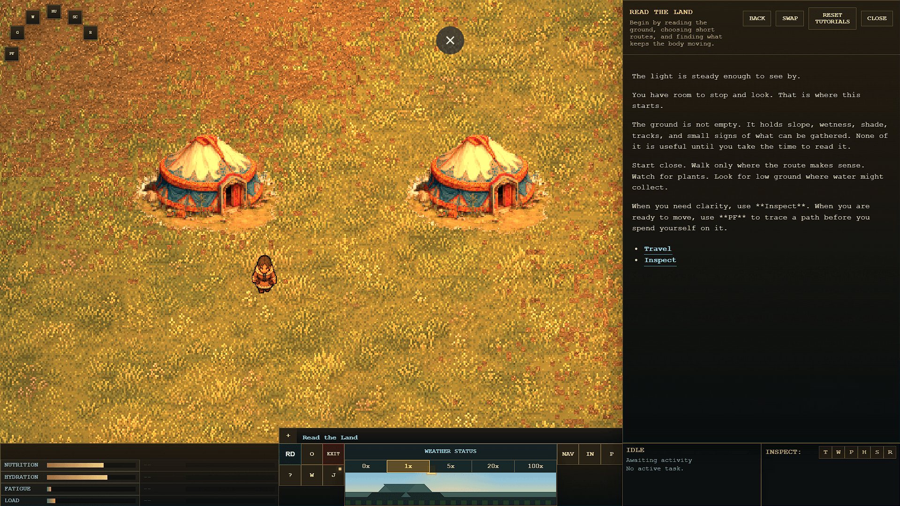
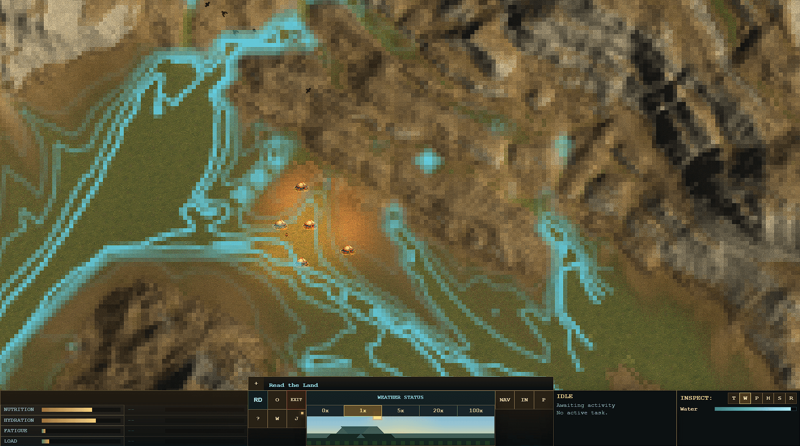
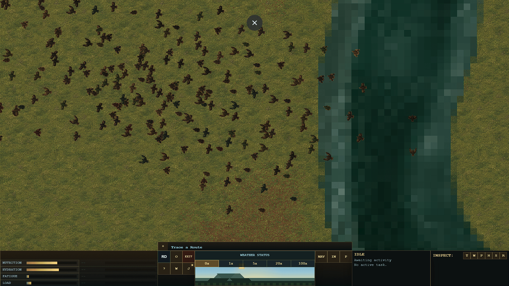

  <section class="sc-landing-hero">
    

    

    

      
A nomadic survival roguelike

      <h1>Scaedumar</h1>
      
Scenario-based survival through terrain, animal senses, spirit-world pressure, and careful movement.

      

        <a class="hero-cta primary" href="game/overview/">Enter the Game</a>
        <a class="hero-cta secondary" href="wiki/">Field Notes</a>
        <a class="hero-cta secondary" href="GAMEPLAY_DESIGN/">Design Direction</a>
      

    

  </section>

  <section class="sc-landing-panel sc-landing-panel--narrow">
    
Read, move, risk, endure.

    <h2>The world presses back.</h2>
    
Cross a pass before snow closes it. Keep a small group alive through a hard season. Follow animals, negotiate with people and spirits, and decide when to stay, move, sacrifice, or endure.

  </section>

  <section class="sc-landing-split">
    

      terrain
    

    

      
Read before moving.

      <h2>Look close first.</h2>
      
Inspect narrows attention to one kind of sign. Water, plants, tracks, and known ground become useful only when the player has taken time to read them.

      <a class="sc-landing-link" href="guide/inspect/">Inspect the world</a>
    

  </section>

  <section class="sc-landing-panel sc-landing-panel--quote">
    
Do I stay one more turn to gain something, or move before the land turns against me?

  </section>

  <section class="sc-landing-gallery" aria-label="Game impressions">
    <figure>
      
      <figcaption>Camp is a place to pause, not a promise of safety.</figcaption>
    </figure>
    <figure>
      
      <figcaption>Signs become useful when the ground has been read.</figcaption>
    </figure>
    <figure>
      
      <figcaption>Wildlife is part of the pressure, not background decoration.</figcaption>
    </figure>
  </section>

  <section class="sc-landing-split sc-landing-split--reverse">
    

      route
    

    

      
Movement is commitment.

      <h2>Trace the path, then pay for it.</h2>
      
Travel is chosen before it is spent. Pathfinding previews show whether nearby ground can be crossed and what the route will ask from time and condition.

      <a class="sc-landing-link" href="guide/travel/">Plan travel</a>
    

  </section>

  <section class="sc-landing-cards">
    <a href="game/overview/">
      Player Site
      <strong>Premise, setting, prototype state, and practical guide.</strong>
    </a>
    <a href="wiki/">
      Field Notes
      <strong>The player-facing wiki used by the game.</strong>
    </a>
    <a href="GAMEPLAY_DESIGN/">
      Gameplay Design
      <strong>Scenario structure, intended fantasy, and long-term direction.</strong>
    </a>
    <a href="moc/">
      Technical Wiki
      <strong>Architecture, design notes, systems, and authoring contracts.</strong>
    </a>
  </section>

