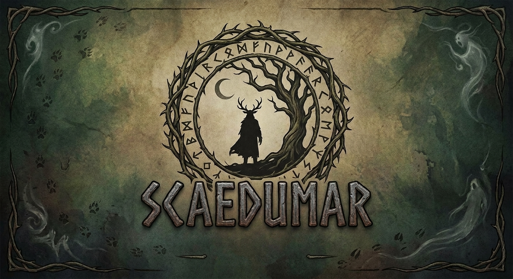

  
  
A mythic world prototype

  <h1 class="hero-title">Scaedumar</h1>
  
Top-down terrain rendering with atmospheric lighting, living simulation, and map-driven gameplay systems.

  

    <a class="hero-cta primary" href="./plans+setups/SMOKE_CHECKLIST.md">Get Started</a>
    <a class="hero-cta secondary" href="./ARCHITECTURE.md">Technical Deep Dive</a>
  

## Enter the World

Scaedumar blends hand-authored terrain maps with a stylized day-night cycle, terrain-aware shadows, water flow, point lights, and swarm behavior.
This site is now structured as a game portal first, with technical documentation available as supporting material.

  <a class="feature-card" href="./ARCHITECTURE.md">
    <h3>Engine Core</h3>
    
WebGL2 terrain pipeline, map-sidecar settings, and modular runtime ownership.

  </a>
  <a class="feature-card" href="./visual-baselines/README.md">
    <h3>Visual Baselines</h3>
    
Reference captures and smoke-validation snapshots for rendering consistency.

  </a>
  <a class="feature-card" href="./plans+setups/SMOKE_CHECKLIST.md">
    <h3>Setup & Validation</h3>
    
Runbook for local verification, smoke checks, and release-adjacent readiness.

  </a>
  <a class="feature-card" href="./notes/Ideas.md">
    <h3>Worldbuilding Notes</h3>
    
Creative direction and systems ideation shaping the broader game vision.

  </a>

## Build Pillars

- Stylized map-first rendering with crisp zoom and hand-authored art direction.
- Day and night lighting model with sun, moon, cloud shadows, volumetrics, and water FX.
- Gameplay scaffolding for pathfinding, point-light editing, and agent swarm simulation.
- Browser-native runtime with a Tauri desktop delivery path.

## Current Focus

Early-stage production prioritizes rapid iteration and visual identity over heavy process.
Landing experience and global theme are now game-oriented, while deeper documentation remains accessible through the navigation.
